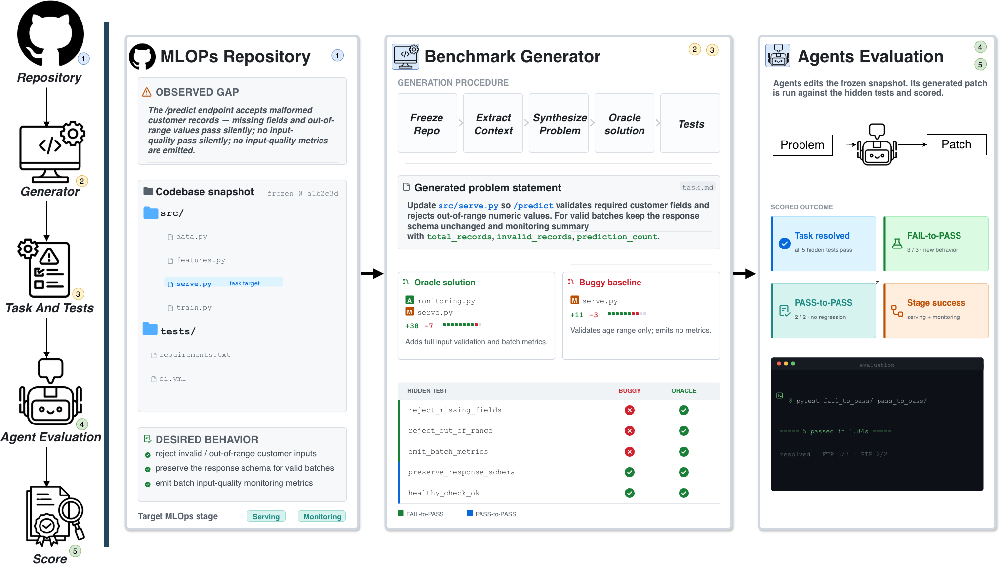
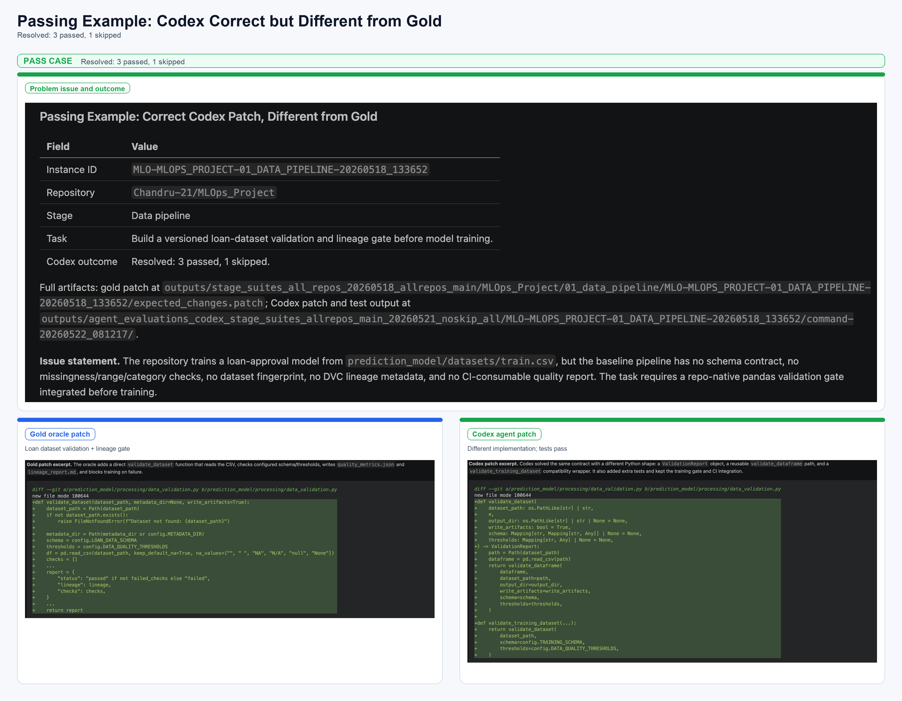
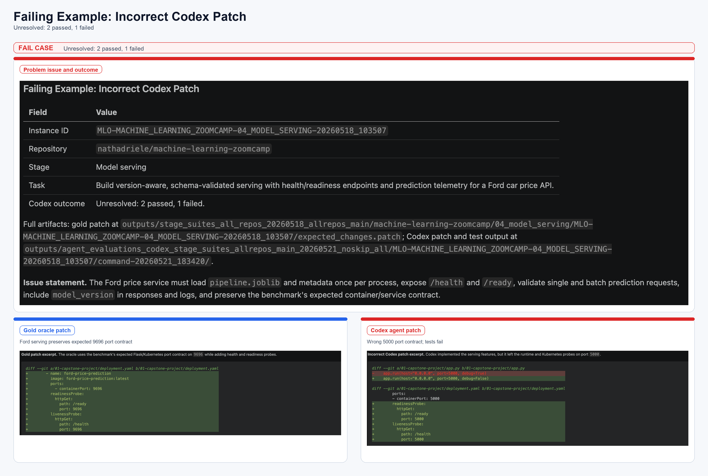

<!--
Licensed under the Apache License, Version 2.0 (the "License");
you may not use this file except in compliance with the License.
You may obtain a copy of the License at

    http://www.apache.org/licenses/LICENSE-2.0

Unless required by applicable law or agreed to in writing, software
distributed under the License is distributed on an "AS IS" BASIS,
WITHOUT WARRANTIES OR CONDITIONS OF ANY KIND, either express or implied.
See the License for the specific language governing permissions and
limitations under the License.
-->


**[EMNLP 2026]** MLOps-Bench: Benchmarking AI Agents on Production ML Engineering in Real Repositories

<p align="center">
  
</p>
<p align="center"><em>Figure 1. MLOps-Bench construction and evaluation pipeline. Source: companion manuscript.</em></p>

## Overview
MLOps-Bench evaluates coding agents on repository-grounded MLOps engineering
changes. Each task provides a natural-language specification, a starting task
workspace, a buggy baseline, an oracle implementation, and executable
evaluation tests. Fail-to-pass (F2P) tests check newly required behavior, while
pass-to-pass (P2P) tests protect existing behavior.

## Links

- [Task corpus](dataset/mlops-bench/)
- [Dataset manifest](dataset/mlops-bench/manifest.json)
- [Source-repository inventory](dataset/metadata/SOURCE_REPOSITORIES.tsv)
- [Contribution guide](CONTRIBUTING.md)
- [Security policy](SECURITY.md)

## At a glance

| Area | Release contents |
| --- | --- |
| Tasks | 212 executable benchmark tasks |
| Lifecycle coverage | Seven MLOps stage categories |
| Source provenance | 31 public source repositories with pinned commits and license material |
| Scoring tests | 636 F2P tests and 856 P2P tests |
| Execution model | Individual task workspaces or a compatible external harness |

## Benchmark coverage

The task distribution below comes from the
[dataset manifest](dataset/mlops-bench/manifest.json).

| MLOps stage | Tasks | F2P tests | P2P tests |
| --- | ---: | ---: | ---: |
| Data pipelines | 31 | 93 | 120 |
| Feature engineering | 30 | 90 | 118 |
| Model training | 29 | 87 | 106 |
| Model serving | 31 | 93 | 134 |
| Monitoring and observability | 31 | 93 | 130 |
| CI/CD and governance | 31 | 93 | 123 |
| End-to-end MLOps flow | 29 | 87 | 125 |
| **Total** | **212** | **636** | **856** |

## Get started

### Prerequisites

- Git
- Python 3.9 or later
- `pytest` to run the Python contract tests

No Oracle Cloud service, API key, build system, or deployment environment is
required to inspect the dataset or run an individual oracle contract test.

### Installation

Clone the repository and install the test runner in an isolated environment:

```bash
git clone https://github.com/oracle-samples/mlops-bench.git
cd mlops-bench
python3 -m venv .venv
. .venv/bin/activate
python -m pip install --upgrade pip pytest
```

## Work with a task

Tasks are organized by source repository, MLOps stage, and instance ID:

```text
dataset/mlops-bench/<repository>/<stage>/<instance>/
```

Each task contains the following core material:

| Path | Purpose |
| --- | --- |
| `README.md` and `problem.json` | Task statement and requirements |
| `repo/` | Starting task workspace |
| `buggy/` | Intentionally incomplete baseline |
| `oracle/` | Reference implementation and oracle contract test |
| `tests/test_f2p.py` | Tests for newly required behavior |
| `tests/test_p2p.py` | Tests for behavior that must remain stable |
| `metadata.json` | Task metadata, including published F2P/P2P counts |
| `expected_changes.patch` | Reference patch artifact |

To validate a selected task's oracle contract, run `pytest` from its
`oracle/` directory. For example:

```bash
TASK=dataset/mlops-bench/01_GOOGLECLOUDPLATFORM__MLOPS_WITH_VERTEX_AI/01_data_pipeline/MLO-01_GOOGLECLOUDPLATFORM__MLOPS_WITH_VERTEX_AI-01_DATA_PIPELINE-20260728_194731
(cd "$TASK/oracle" && python -m pytest -q tests/test_stage_contract.py)
```

For suite-wide agent evaluation, a compatible external harness must select a
task, provide its workspace and specification to an agent, and apply the
benchmark's evaluation tests. MLOps-Bench intentionally does not prescribe a
single runner or agent integration.

## Evaluation conventions

F2P and P2P counts refer to public `test_*` functions in each task's
`tests/test_f2p.py` and `tests/test_p2p.py` files, respectively. The task-level
`f2p_test_count` and `p2p_test_count` metadata fields use the same convention.
The auxiliary oracle contract tests under `oracle/tests/` are intentionally not
included in the published F2P/P2P totals.

<details>
<summary><strong>Illustrative agent outcomes from the paper</strong></summary>

<br>

<p align="center">
  
  
</p>
<p align="center"><em>Figure 2. Passing and failing agent outcomes reported in the companion manuscript. These examples illustrate behavioral evaluation, not a bundled user interface or runner.</em></p>

</details>

## Reproducibility and provenance

The [dataset manifest](dataset/mlops-bench/manifest.json) records the task and
test totals. The [source-repository inventory](dataset/metadata/SOURCE_REPOSITORIES.tsv)
records public project URLs, pinned commits, license text locations, and
applicable upstream notices. The corresponding third-party license and notice
materials are available under
[`dataset/metadata/`](dataset/metadata/).

## Citation

If you use MLOps-Bench, please cite the work:

```bibtex
@misc{tran2026mlopsbench,
  title = {MLOps-Bench: Benchmarking AI Agents on Production ML Engineering in Real Repositories},
  author = {Quoc Co Tran and Hitesh Laxmichand Patel and Diwakar Mahajan and Kshitij Bakliwal and Avi Sil and Katrin Kirchhoff},
  year = {2026},
  note = {Manuscript}
}
```

## Contributing

This project welcomes contributions from the community. Before submitting a
pull request, please [review the contribution guide](CONTRIBUTING.md).

## Security

Please consult the [security guide](SECURITY.md) for responsible vulnerability
disclosure.

## License

Copyright (c) 2026 Oracle and/or its affiliates.

Released under the [Apache License version 2.0](LICENSE).
